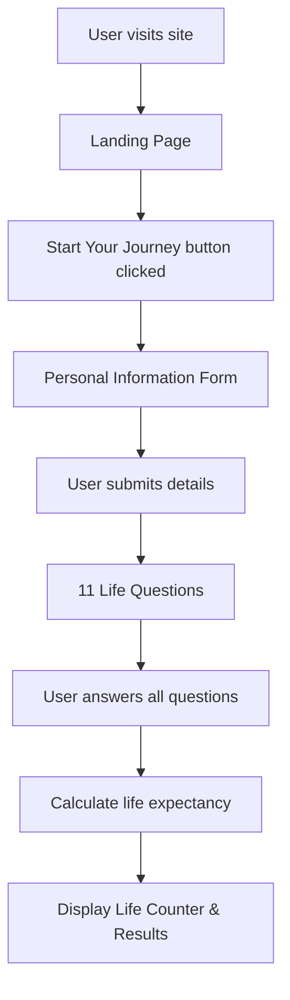

# Death Clock 🎯


## Basic Details
### Team Name: Localghost

### Team Members
- Team Lead: Tino Sabu - SCMS School Of Engineering and Technology
- Member 2: Pranav Jayan - SCMS School Of Engineering and Technology

### Project Description
A quirky web app that calculates how many years, days, and seconds you have left to live — based on your age and lifestyle answers. It turns life expectancy into a personalized countdown clock for some deep (or dark) reflection.

### The Problem (that doesn't exist)
People never know exactly how much time they have left — but who really wants to think about that? Let’s add a little dramatic countdown just for fun!

### The Solution (that nobody asked for)
By asking silly and serious questions about your habits, this app gives you a life clock ticking down your remaining time — because everyone needs a little existential motivation disguised as a game!

## Technical Details
### Technologies/Components Used

- Languages: HTML, CSS, JavaScript

- Frameworks: None (vanilla JS)

- Libraries: FontAwesome for icons, Google Fonts for typography

- Tools: VS Code for development, Chrome DevTools for debugging

### Implementation
For Software:
# Installation

```
git clone https://github.com/Tino-sabu/Death-Clock.git
cd Death-Clock 
```
# Run
##### Using Python 3.x
```
python -m http.server 8000

Then open http://localhost:8000 in your browser
```

### Project Documentation
For Software:

# Screenshots 


*Landing page - Click 'Start your journey' to continue*


*Prompts for the user to enter his details*


*Prompts the user with 11 different questions related to hoomans life*


*Calculates estimated amount of years you have remaining to live*


### Project Demo
# Video


https://github.com/user-attachments/assets/90cee56f-f8ac-4549-b001-4993c1b6591f

*Firstly users enters his/her details, subsequently completes 11 different questions and then it displays estimated amount of years you have remaining to live*


# Diagrams


   
## Team Contributions
- Tino Sabu: Backend + Frontend
- Pranav Jayan: Backend + Frontend

---
Made with ❤️ at TinkerHub Useless Projects 


